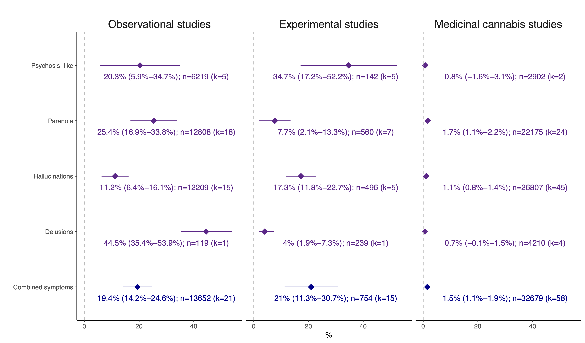
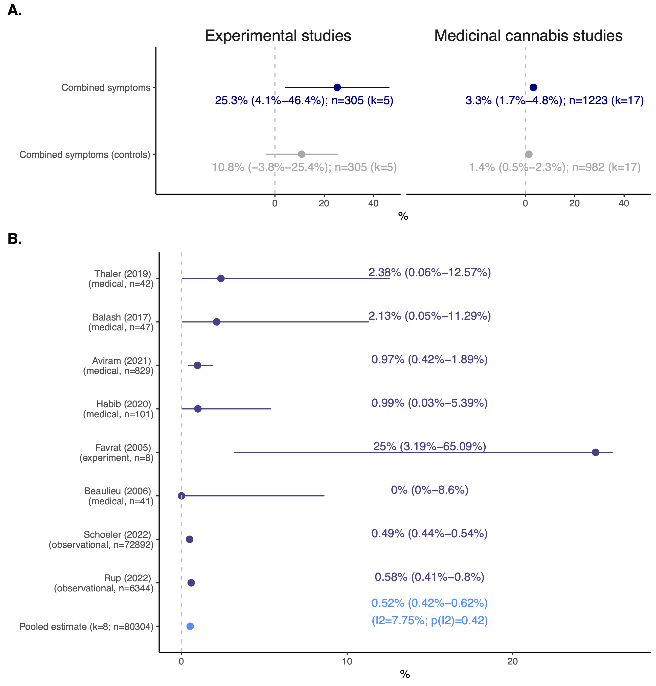

Rates and predictors of cannabis-associated psychotic symptoms: A meta-analysis synthesizing observational, experimental and medical research
================

  

# Overview

All analyses were performed in R. The complete analytical pipeline used to run the analyses is included in the script
[analysis.R](https://github.com/TabeaSchoeler/TS2023_MetaCAPS/blob/main/analysis/litSearch.R).

 

## Data

All study estimates analysed in this work are available [here](https://github.com/TabeaSchoeler/TS2023_MetaCAPS/tree/main/data)

 

## Analytical scripts

The following analytical scripts are available:

1) [functions.R](https://github.com/TabeaSchoeler/TS2023_MetaCAPS/blob/main/analysis/functions.R): Script including all derived functions used to perform the analyses
2) [litSearch.R](https://github.com/TabeaSchoeler/TS2023_MetaCAPS/blob/main/analysis/litSearch.R): Script to conduct the systematic literature research in R 
3) [runMeta.R](https://github.com/TabeaSchoeler/TS2023_MetaCAPS/blob/main/analysis/runMeta.R): Script to process the extracted [data](https://github.com/TabeaSchoeler/TS2023_MetaCAPS/tree/main/data) and perform meta-analyses on rates and predictors of CAPS
4) [createTable.R](https://github.com/TabeaSchoeler/TS2023_MetaCAPS/blob/main/analysis/createTable.R): Script to generate [supplementary tables](https://github.com/TabeaSchoeler/TS2023_MetaCAPS/tree/main/results/tables/)

 

## Results

This repository includes the following files:

-   [Systematic literature search](#systematic-literature-search)

-   [Rates of cannabis-associated psychosis](#rates-of-cannabis-associated-psychosis)

  

### Systematic literature search

#### Figure 1. Number of included studies and study participants per study design, according to year of publication

Number of included studies per year of publication and study design, including (1) observational research assessing recreational cannabis users, (2) experimental studies administering tetrahydrocannabinol (THC) in healthy volunteers and (3) medical studies assessing adverse events in individuals taking cannabis products for medicinal use. Quasi-experimental research involved research testing the effects of THC administration in a naturalistic setting

 

### Rates of cannabis-associated psychosis

#### Figure 2. Rates of cannabis-associated psychotic symptoms

The figure shows the pooled rates of cannabis-associated psychotic symptoms (CAPS) across the three different study designs. Estimates displayed in purple are the pooled rates (in %, 95% Confidence Interval) for each symptom profile of CAPS (psychosis-like symptoms, hallucinations, paranoia) separately. Estimates displayed in blue are the results from models pooling together all estimates on rates of CAPS (including psychosis-like symptoms, paranoia, hallucinations and delusions) per study design. k=number of published studies included in the model; n=number of included (non-overlapping) individuals. 

 

#### Figure 3. Rates of cannabis-associated psychotic symptoms (sensitivity analyses)

Figure 3. Rates of cannabis-associated psychotic symptoms (sensitivity analyse
Panel A. Pooled rates of CAPS in exposed versus non-exposed individuals taking part in placebo-controlled studies. Estimates highlighted in grey index rates of CAPS in non-cannabis exposed control groups, as assessed in experiments and medicinal cannabis trials. Panel B. Studies reporting rates of cannabis-associated psychosis (full episode). Depicted in violet are the individual study estimates (in %, 95% Confidence Intervals) of studies reporting rates of (full-blown) cannabis-associated psychotic episodes. Included are studies using medicinal cannabis, observational or experimental samples. The pooled meta-analysed estimate is coloured in blue. I2 statistic (scale of 0 to 100) indexes the level of heterogeneity across the estimates included in the meta-analysis. k=number of published studies included in the model; n=number of included (non-overlapping) individuals. 

 

#### sFigure 3. Peters’ test for publication bias (rates of CAPS)

Funnel plots show each meta-analytical model on rates of CAPS separately. The individual proportions (x-axis) of CAPS are plotted against the standard error (y-axis). The black and grey horizontal lines indicate the pooled proportion of CAPS and their corresponding 95% confidence interval. The dashed and dotted lines highlight the 95% and 99% confidence interval region, respectively. Whenever risk of publication bias was indicated (Peters’ test for publication bias p<0.05), the trim-and-fill method was applied. The trim-and-fill adjusted pooled rate of CAPS is included in the caption of the funnel plot.
